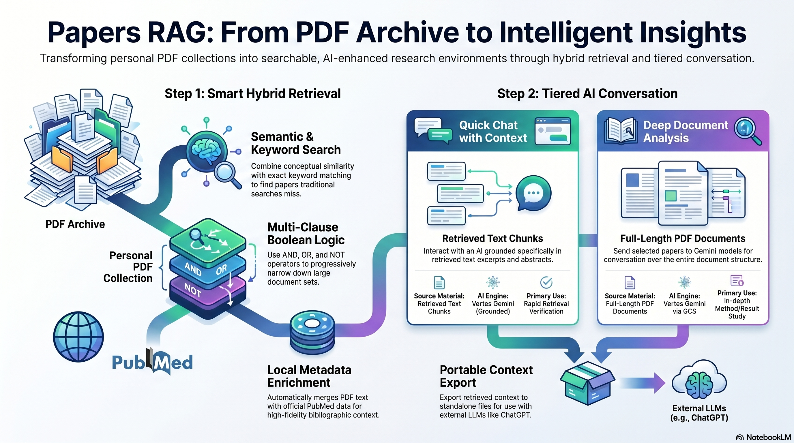

### 5 minutes NotebookLM Audio Explaining Papers RAG

<a href="https://drive.google.com/file/d/1dN4kUKkY3wGlL1KVHW9-9HSszCJEKyhW/view?usp=sharing" target="_blank" rel="noopener noreferrer"><strong>Listen</strong></a>

## Semantic/RAG Session Example

<a href="./papers-rag_session_example.pdf" target="_blank" rel="noopener noreferrer"><strong>Open example search session (PDF)</strong></a>

This session shows some of the features of the application's UI: creating a boolean search, optionally reviewing search diagnostics to refine the query, and using an online chat session with a cloud LLM to narrow and focus on the papers you want.

---

# Papers RAG App

**Papers RAG (v2.5)** is a **Streamlit** application for retrieval-augmented work over a **local PDF library**. Point it at a folder of scientific PDFs, build the local indexes from the sidebar, and use **Tab 1** for boolean semantic/keyword search, selection, export, and **Quick Chat**; use **Tab 2** for **Deep Chat** over full PDFs via **Google Vertex AI (Gemini)** and **Google Cloud Storage**.

## What the app does

### Corpus and indexes

PDFs live under a **papers root** directory you configure in **`.env`** (`PAPERS_DIR`). You can also switch libraries from the sidebar; the active folder is remembered in `.papers_rag_state.json` (in the app directory).

All working data for a library is stored alongside the PDFs under:

```
<PAPERS_DIR>/papers-rag_index/
  chroma_db/                 # full-text vectors + metadata vectors
  keyword_index.sqlite         # keyword (FTS) index (inside chroma_db/)
  abstract_meta/               # per-PDF JSON sidecars
  exported_prompts/            # export files for external LLMs
  selected_pdfs/               # Deep Chat staging (timestamp subfolders)
  databases_health_reports/    # sync health reports (TXT + HTML)
```

Use **🧭 Synchronize/Build/Update Databases** in the sidebar to run the full maintenance pipeline in order: update the PDF vector index, rebuild the keyword index, refresh missing `abstract_meta` JSON, rebuild the metadata vector index, and write health reports. You can still run individual sidebar steps when you prefer.

### Search (Tab 1)

**Multi-clause boolean search** — Each clause is **semantic** (embedding similarity) or **keyword** (full-text match via the local FTS index). Each clause is evaluated independently and returns a set of matching papers; those paper sets are then combined with **AND**, **OR**, and **NOT**, including **grouped** expressions (parentheses via group splits).

- Set a **minimum similarity** cutoff for semantic hits; **keyword** matches are still shown when they match.
- Choose **semantic discovery source**: full-text chunks, `abstract_meta` JSON, union, or intersection.
- **Evidence pass:** Runs when you **Search** (not when you chat or export). After boolean discovery, the app fetches additional supporting chunks per paper in the final result set (default up to **`EVIDENCE_CHUNKS_PER_PAPER=3`**). These appear in the hit list and in **Export**; they are not re-fetched for Quick Chat.
- **Search diagnostics** show per-clause timing and discovery stats to help tune queries.

You do **not** need to search first: **paste PDF basenames** (one per line) to add **manual-only papers**. The app resolves names case-insensitively against the indexed corpus. **Apply pasted names** auto-checks every match: papers already in the current filtered hit list are selected under *Search hit papers*; others are added as **manual-only papers** (also auto-selected).

### Evidence and abstracts

For papers in the **current filtered hit list**, the UI can show **multiple excerpts** per paper (discovery plus evidence chunks; keyword hits may show expanded context). Keyword highlighting applies where relevant.

Each paper can have a mirrored **`abstract_meta` JSON** file under `abstract_meta/`, produced from PDF text heuristics and optionally enriched with **PubMed / NCBI**. The running app **reads** these files for titles and abstracts during browsing; it does not call NCBI unless you run extraction with PubMed enabled.

Refresh metadata from the sidebar (**abstract_meta** controls).

### Selection, export, and Quick Chat

Checked rows (search hits and/or **manual-only papers**) drive:

- **📄 Export context for external LLM** — writes `prompt_context_*.txt` under `exported_prompts/` for use with **your preferred LLM** (ChatGPT, Claude, etc.). For checked **search-hit** papers: `abstract_meta` plus **all matching excerpts** from the last search (including the evidence pass). For checked **manual-only papers**: `abstract_meta` only. Export is the **full-context, portable** path when you need every retrieved passage or a model outside Vertex.
- **💬 Quick Chat (Vertex)** on Tab 1 — in-app streaming chat with Gemini. Each question sends a **fixed context block** built from your **checked** papers only (not the whole library, not full PDFs):

  | Paper type | What Gemini sees |
  |------------|------------------|
  | **Search-hit paper** (in the current filtered hit list) | **`abstract_meta` JSON** (title, PDF abstract, optional PubMed abstract when present) **plus one PDF text excerpt** (about 1,000 characters): the **highest-scoring chunk** from the **last Search** for that paper (may be a discovery or evidence chunk). |
  | **Manual-only paper** (pasted basename, not in the hit list) | **`abstract_meta` JSON only** — no PDF excerpts. |

  Quick Chat does **not** include: other chunks shown in the UI, a new search, or the evidence pass run again. It does **not** send every excerpt (that is what **Export** is for)—keeping one excerpt per hit paper avoids overloading the prompt. Requires Vertex + ADC in **`.env`**.

### Deep Chat (Tab 2)

On Tab 1, **Send selected papers to Deep Chat** stages checked PDFs under `selected_pdfs/<YYYYMMDD_HHMMSS>/` (symlink when possible, copy otherwise). On Tab 2, use **Upload to Google Cloud** to send them to **`gs://`**, then chat with **Gemini** on the full documents. Uses **Application Default Credentials** and project/bucket settings in **`.env`** — not AI Studio API keys.

### Local PDF links

**`pdf_server.py`** serves PDFs at `http://localhost:<port>/...` (default **8502** while Streamlit is on **8501**) so titles and filenames open in the browser.

## How this repository was created

- The application was designed and built using **[Cursor](https://cursor.com)** (AI-assisted coding, code revision, debugging and refactoring also using OpenAI Codex).
- The **GitHub repository** uses the **GitHub MCP** inside Cursor when helpful (creating or updating content on GitHub programmatically).

## Installation and operations

### Configure `.env`

Copy [`.env.example`](./.env.example) to **`.env`** and set the values that apply to your machine.

| What to set | Variables | Purpose |
|-------------|-----------|---------|
| **Vertex / GCS** | `GCP_PROJECT`, `GCS_BUCKET` | Project and bucket for Gemini and PDF uploads. Optional: `GCP_LOCATION`, `GEMINI_MODEL` (see `.env.example`). |
| **Auth (not in `.env`)** | — | **Application Default Credentials**: `gcloud auth application-default login`. Required for Quick Chat and Deep Chat, in addition to `.env`. |
| **PDF library** | `PAPERS_DIR` | Root folder containing your PDFs (**must already exist**). Indexes and sidecars are created under `<PAPERS_DIR>/papers-rag_index/`. |
| **PubMed (optional)** | `NCBI_EMAIL`, `NCBI_API_KEY` | For PubMed enrichment during `abstract_meta` extraction (sidebar or CLI). |
| **Tuning (optional)** | `PAPER_DISCOVERY_*`, `EVIDENCE_CHUNKS_PER_PAPER`, `KEYWORD_*`, `PDF_SERVER_PORT` | Search/discovery and keyword behavior; defaults are in `.env.example`. |

### Detailed installation guide

<a href="./Papers_RAG_installation_guide_v2.5_gcloud_snapshot.md" target="_blank" rel="noopener noreferrer"><strong>Papers RAG V2.5 Installation</strong></a>


## Run

After the Conda environment, `.env`, and ADC are configured:

```bash
conda activate papers_rag
streamlit run app.py --server.port=8501
```

- App UI: **http://localhost:8501**
- Local PDF server: **http://localhost:8502** (see `pdf_server.py`)

## Repository layout

| Path | Role |
|------|------|
| `app.py` | Streamlit UI: search, diagnostics, sync, Quick Chat, Deep Chat, export |
| `indexer.py` | PDF ingest, ChromaDB, FTS keyword index, metadata index, boolean/hybrid search |
| `rag_engine.py` | Vertex Gemini client, context building, GCS, streaming chat |
| `pdf_server.py` | Static HTTP server for clickable local PDF URLs |
| `papers_rag_config.py` | Loads `.env`, resolves `PAPERS_DIR`, derives `papers-rag_index/` paths |
| `papers_paths.py` | Corpus root and PDF discovery |
| `extract_abstracts.py` | CLI: batch-write `abstract_meta/*.json` per PDF |
| `abstract_extraction.py` | Title/abstract/DOI heuristics and JSON load/save |
| `ncbi_pubmed.py` | NCBI Entrez helpers for optional PubMed enrichment |
| `.env.example` | Template for `.env` |
| `environment.yml` | Primary Conda environment |
| `environment_from_history.yml` | Alternate env export (reference) |
| `requirements.txt` | Pip dependencies |
| `Papers_RAG_installation_guide_v2.5_gcloud_snapshot.md` | Setup and operations guide |
| `papers-rag_session_example.pdf` | Example boolean search + chat session (see above) |
| `notebooklm_infographic.png` | NotebookLM infographic (README hero) |
| `rag-papers_technical_description.md` | Technical architecture and modules — [**Papers RAG Technical Description**](#papers-rag-technical-description) |
| `README.md` | This file |
| `.gitignore` | Excludes `.env`, private notes, etc. |


## Papers RAG Technical Description

Architecture, retrieval design, metadata pipeline, and Streamlit workflows are documented in [**`rag-papers_technical_description.md`**](rag-papers_technical_description.md).
